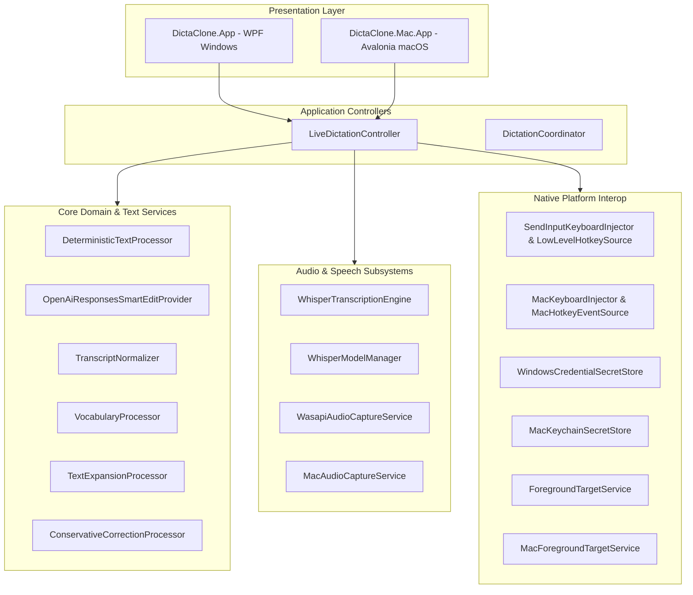
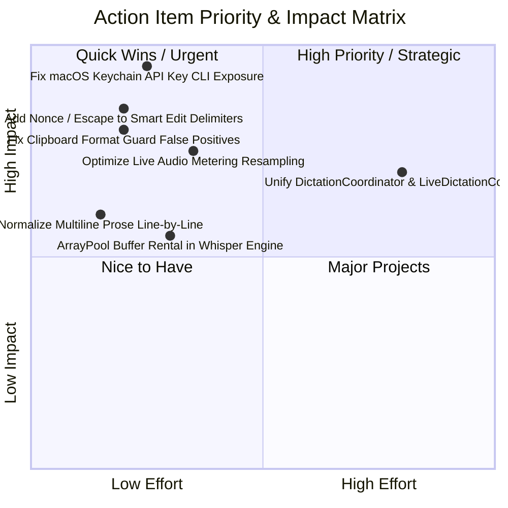

# Comprehensive Code Review: DictaClone

**Repository:** `https://github.com/herma48852/dictaclone`  
**Review Target:** Full Architectural, Security, Performance, Quality, and Testing Audit  
**Codebase Scale:** ~37,698 Total Lines of Code (TLOC)
- **C# Source:** 16,864 lines across 9 projects
- **C# Unit & Integration Tests:** 7,875 lines across 10 test suites
- **Documentation & Specifications:** 2,696 lines
- **Tooling & Automation Scripts (PowerShell, Bash, Swift):** 2,865 lines
- **Runtime Environment:** .NET 10.0.302 (Cross-platform Core + WPF on Windows 11 + Avalonia / CoreAudio / Quartz on macOS 14+)

---

## Table of Contents
1. [Executive Summary](#1-executive-summary)
2. [Codebase Composition & Project Layout](#2-codebase-composition--project-layout)
3. [Architecture & System Design Audit](#3-architecture--system-design-audit)
4. [Security & Privacy Audit](#4-security--privacy-audit)
5. [Performance, Memory & Allocation Profiling](#5-performance-memory--allocation-profiling)
6. [OS Integration, Interop & Subsystem Reliability](#6-os-integration-interop--subsystem-reliability)
7. [Text Pipeline & Normalization Analysis](#7-text-pipeline--normalization-analysis)
8. [Concurrency, State Machines & Thread Safety](#8-concurrency-state-machines--thread-safety)
9. [Automated Testing & QA Evaluation](#9-automated-testing--qa-evaluation)
10. [Detailed Findings & Actionable Remediation Plan](#10-detailed-findings--actionable-remediation-plan)

---

## 1. Executive Summary

DictaClone is an exceptionally well-engineered desktop dictation and text-editing platform. It implements a local-first voice-to-text workflow powered by OpenAI's Whisper model (via `Whisper.net`), supporting global hotkey triggers, active window detection, low-latency audio capture, and cursor-targeted text insertion via simulated keystrokes and clipboard swapping.

### Primary Strengths
- **Clean Architecture & Separation of Concerns:** Core workflow, domain models, text post-processing, and persistence are decoupled into cross-platform libraries with zero UI dependencies.
- **Privacy-by-Default Design:** Zero cloud transmission by default. Diagnostic logging and support bundles explicitly scrub personal identifiable information (PII) and exclude audio/transcripts.
- **Defensive OS Interop:** Comprehensive native integration across both Windows 32-bit/64-bit API hooks and macOS CoreAudio / CoreFoundation / Quartz / Accessibility subsystems.
- **Fail-Safe Persistence:** Atomic file writes with disk sync, automated quarantine for corrupt JSON configurations, and transactional settings migration.

### Key Risk Areas & Required Improvements
1. **Plaintext Secret Exposure on macOS:** Passing API keys via `/usr/bin/security` command-line arguments leaks credentials in the OS process table.
2. **Prompt Injection Boundary Collision:** Static delimiters in LLM Smart Edit allow potential delimiter collision attacks from untrusted selected text.
3. **Clipboard Format Contention on Windows:** Strict native format counting causes dictation to fail when non-deserializable binary formats reside on the clipboard.
4. **Audio Metering Overhead:** Resampling entire audio buffers during real-time capture for level meters adds unnecessary GC and CPU overhead.

---

## 2. Codebase Composition & Project Layout

```
dictaclone/
├── src/
│   ├── DictaClone.Core/            # Domain models, contracts, settings validation, workflow coordinators
│   ├── DictaClone.Text/            # Deterministic normalizer, Smart Edit builder, corrections, vocabulary
│   ├── DictaClone.Speech/          # Whisper.net wrapper, model download manager, prompt builders, scorers
│   ├── DictaClone.Infrastructure/  # Atomic file writer, JSON stores, privacy-safe logs, support bundle zip
│   ├── DictaClone.Audio/           # Windows WASAPI capture, PCM converter, device enumerator
│   ├── DictaClone.Windows/         # Win32 hooks, SendInput injector, clipboard guard, Credential Manager
│   ├── DictaClone.App/             # Windows WPF UI, live controller, tray icon, settings window, overlays
│   ├── DictaClone.Mac/             # macOS Core Audio, CGEventTap hotkeys, Accessibility selection, Keychain
│   └── DictaClone.Mac.App/         # macOS Avalonia UI, menu bar tray, settings and history windows
├── tests/
│   ├── DictaClone.Core.Tests/
│   ├── DictaClone.Text.Tests/
│   ├── DictaClone.Infrastructure.Tests/
│   ├── DictaClone.Speech.Tests/
│   ├── DictaClone.Audio.Tests/
│   ├── DictaClone.Windows.Tests/
│   ├── DictaClone.Mac.Tests/
│   ├── DictaClone.App.Tests/
│   ├── DictaClone.EndToEndTests/
│   └── DictaClone.IntegrationTests/
├── docs/                           # Implementation plans, porting guides, clean-room setup, release notes
└── scripts/                        # Dual-platform build, sign, notarize, test, and release automation
```

### Line Count Distribution

| Category | Extensions | Line Count | Notes |
| :--- | :--- | :--- | :--- |
| **C# Source** | `.cs` | 16,864 | 9 projects in `src/` |
| **C# Tests** | `.cs` | 7,875 | 10 projects in `tests/` |
| **Documentation** | `.md` | 2,696 | Comprehensive architectural specs and milestone logs |
| **Scripts & Tooling** | `.ps1`, `.sh`, `.swift`, `.iss` | 2,865 | Automated packaging, signing, and installer scripts |
| **Markup & Configs** | `.axaml`, `.json`, `.props`, `.slnx` | 7,398 | Package lock files, project files, assets |
| **Total** | | **37,698** | |

---

## 3. Architecture & System Design Audit



### Architectural Highlights
1. **Interface Segregation:** Services depend on narrow, single-responsibility interfaces (`IAudioCaptureService`, `ITranscriptionEngine`, `ITextProcessor`, `IForegroundTargetService`, `ITextInsertionService`, `ISecretStore`, `IHotkeyEventSource`).
2. **Deterministic Processing Pipeline:** `DeterministicTextProcessor` executes text normalizations in a predictable order: Normalization → Conservative Corrections → Vocabulary phrase substitution → Text expansions → Final whitespace normalization.
3. **Pluggable Audio Backend:** Windows utilizes `NAudio.WasapiCapture` streaming IEEE float / PCM audio, while macOS binds directly to `AudioQueue` via P/Invoke.

### Architectural Opportunities
- **Coordinator Duality:** `DictationCoordinator` in `DictaClone.Core` provides a state-machine driven engine, while `LiveDictationController` in `DictaClone.App` implements a separate orchestration flow supporting Smart Edit, selection capture, and UI event posting. Consolidating `DictationCoordinator` as the single core engine (with `LiveDictationController` purely acting as the UI adapter) would eliminate duplicated logic.

---

## 4. Security & Privacy Audit

### 4.1. Vulnerability Findings

#### [CRITICAL] CWE-214 / CWE-532: Plaintext API Key Exposure in Process Table (`MacKeychainSecretStore.cs`)
- **File:** [`src/DictaClone.Mac/Security/MacKeychainSecretStore.cs`](file:///Users/fherman/.gemini/antigravity/scratch/dictaclone/src/DictaClone.Mac/Security/MacKeychainSecretStore.cs#L50-L60)
- **Vulnerability:** When saving the OpenAI API key, `MacKeychainSecretStore` executes the macOS security utility:
  ```csharp
  KeychainCommandResult result = await _commands.RunAsync(
      [
          "add-generic-password",
          "-U",
          "-s", ServiceName,
          "-a", name,
          "-w", value, // <--- Plaintext secret in CLI argument
      ],
      cancellationToken).ConfigureAwait(false);
  ```
- **Risk:** Command-line arguments for all running processes are world-readable to any non-sandboxed process running under the same user UID (and root) via `ps aux`, `pgrep -a`, or `proc_pidinfo`. A background utility or script could scrape the API key while it is being written.
- **Remediation:** P/Invoke `SecItemAdd` and `SecItemUpdate` directly via macOS `Security.framework` using `CFDictionaryRef` attributes, matching the secure DPAPI memory handling used in `WindowsCredentialSecretStore`.

---

#### [HIGH] Prompt Injection Boundary Delimiter Collisions (`SmartEditPromptBuilder.cs`)
- **File:** [`src/DictaClone.Text/SmartEditPromptBuilder.cs`](file:///Users/fherman/.gemini/antigravity/scratch/dictaclone/src/DictaClone.Text/SmartEditPromptBuilder.cs#L9-L70)
- **Vulnerability:** Selected text is enclosed within static boundary strings:
  ```csharp
  public const string SelectionStart = "<<<DICTACLONE_SELECTED_TEXT>>>";
  public const string SelectionEnd = "<<<END_DICTACLONE_SELECTED_TEXT>>>";
  ```
- **Risk:** If a user selects text from an untrusted document containing `<<<END_DICTACLONE_SELECTED_TEXT>>>` followed by adversarial prompts, the model may interpret the payload as system instructions rather than content to be transformed.
- **Remediation:** 
  1. Generate a per-request random cryptographic nonce/GUID delimiter (e.g. `<<<DICTACLONE_SELECTED_TEXT_3f8a9e2d>>>`).
  2. Escape occurrences of the delimiter within `request.SelectedText`.

---

### 4.2. Security Strengths
- **Secure Memory Sanitization:** `WindowsCredentialSecretStore` explicitly clears byte arrays via `Array.Clear` and overwrites native buffers before deallocating `Marshal.FreeHGlobal`.
- **Zero Data Retention in Smart Edit:** Requests sent to the OpenAI Responses API explicitly set `"store": false` and use `"reasoning": { "effort": "low" }`.
- **Cryptographic Model Verification:** Whisper model weights downloaded from HuggingFace are hashed with `SHA256` and verified against catalog constants before promotion to the live model directory.
- **Privacy-Preserving Logs:** `PrivacySafeDiagnosticLog` records only timestamps, event categories, outcomes, and exception types. Transcribed text, audio, and active window titles are never written to disk.

---

## 5. Performance, Memory & Allocation Profiling

### 5.1. Audio Callback Allocation & Resampling
- **File:** [`src/DictaClone.Audio/WasapiAudioCaptureService.cs`](file:///Users/fherman/.gemini/antigravity/scratch/dictaclone/src/DictaClone.Audio/WasapiAudioCaptureService.cs#L380-L413)
- **Issue:** On every audio driver packet (every ~10–50ms), `PublishLevel` executes:
  ```csharp
  CapturedAudio converted = PcmAudioConverter.ConvertToWhisperPcm16(
      nativeAudio, _capture.WaveFormat, silenceThreshold: 0, minimumSpeechDuration: TimeSpan.Zero);
  AudioSignalMetrics metrics = PcmAudioConverter.MeasureWhisperPcm16(converted.Pcm16.Span);
  ```
  `ConvertToWhisperPcm16` instantiates a `MemoryStream`, `RawSourceWaveStream`, `WdlResamplingSampleProvider`, and allocates multiple `float[]` arrays.
- **Impact:** Significant GC churn and CPU cycles consumed on the audio callback thread while the user is actively speaking.
- **Optimization:** Calculate peak and RMS directly on the incoming buffer format (e.g., 48 kHz stereo IEEE Float32) without resampling.

### 5.2. Transcription Float Sample Allocation
- **File:** [`src/DictaClone.Speech/WhisperTranscriptionEngine.cs`](file:///Users/fherman/.gemini/antigravity/scratch/dictaclone/src/DictaClone.Speech/WhisperTranscriptionEngine.cs#L219-L230)
- **Issue:** `ConvertToFloatSamples` allocates `new float[pcm16.Length / sizeof(short)]` on every transcription run. A 60-second utterance allocates ~1.92 MB on the GC heap.
- **Optimization:** Rent buffers from `ArrayPool<float>.Shared` and return them after `processor.ProcessAsync` completes.

### 5.3. Diagnostic Log Allocation
- **File:** [`src/DictaClone.Infrastructure/PrivacySafeDiagnosticLog.cs`](file:///Users/fherman/.gemini/antigravity/scratch/dictaclone/src/DictaClone.Infrastructure/PrivacySafeDiagnosticLog.cs#L51)
- **Issue:** `await stream.WriteAsync("\n"u8.ToArray(), cancellationToken)` allocates a 1-byte array on every log write.
- **Optimization:** Pass `"\n"u8` (`ReadOnlyMemory<byte>`) directly.

---

## 6. OS Integration, Interop & Subsystem Reliability

### 6.1. Windows Subsystem Analysis

#### Clipboard Native Format Guard Failure on Proprietary Formats
- **Files:** [`src/DictaClone.Windows/ClipboardNativeFormatGuard.cs`](file:///Users/fherman/.gemini/antigravity/scratch/dictaclone/src/DictaClone.Windows/ClipboardNativeFormatGuard.cs#L7-L17), [`WindowsClipboardBackend.cs`](file:///Users/fherman/.gemini/antigravity/scratch/dictaclone/src/DictaClone.Windows/WindowsClipboardBackend.cs#L10-L38)
- **Problem:** `ClipboardNativeFormatGuard.CaptureLostContent` asserts:
  ```csharp
  internal static bool CaptureLostContent(int availableFormatCount, int capturedFormatCount) =>
      availableFormatCount > 0 && capturedFormatCount == 0;
  ```
  If an application puts unmanaged binary clipboard formats onto the clipboard (e.g., AutoCAD shapes, virtual machine clipboard sync, proprietary editor formats), `System.Windows.Forms.DataObject` fails to read them (`capturedFormatCount == 0`), but Windows reports formats exist (`CountClipboardFormats() > 0`).
  This causes `CaptureStableSnapshot` to fail all 10 retry attempts and throw `ClipboardContentionException`, preventing the user from dictating in Paste Mode.
- **Solution:** If no formats can be parsed by .NET, treat the clipboard snapshot as empty/non-restorable rather than aborting text insertion.

#### Keyboard Injection Structure Alignment
- **File:** [`src/DictaClone.Windows/SendInputKeyboardInjector.cs`](file:///Users/fherman/.gemini/antigravity/scratch/dictaclone/src/DictaClone.Windows/SendInputKeyboardInjector.cs#L235-L275)
- **Assessment:** Correctly models the `INPUT` union size and alignment across 32-bit and 64-bit architectures by including `MouseInput` in the explicit layout union.

---

### 6.2. macOS Subsystem Analysis

#### Event Tap Timeout Auto-Recovery
- **File:** [`src/DictaClone.Mac/Input/MacHotkeyEventSource.cs`](file:///Users/fherman/.gemini/antigravity/scratch/dictaclone/src/DictaClone.Mac/Input/MacHotkeyEventSource.cs#L195-L217)
- **Assessment:** Exceptionally resilient. macOS automatically disables `CGEventTap` instances if a callback blocks too long (`kCGEventTapDisabledByTimeout`). `MacHotkeyEventSource` detects this event type, resets the modifier tracking state, and invokes `CGEventTapEnable(tap, true)` to restore hotkey monitoring seamlessly.

#### Accessibility Selected Text Extraction
- **File:** [`src/DictaClone.Mac/Selection/MacSelectedTextService.cs`](file:///Users/fherman/.gemini/antigravity/scratch/dictaclone/src/DictaClone.Mac/Selection/MacSelectedTextService.cs#L68-L117)
- **Assessment:** Uses `AXUIElementCopyAttributeValue` (`kAXFocusedUIElementAttribute` → `kAXSelectedTextAttribute`) to extract selected text directly without touching the system clipboard or sending simulated keystrokes.

---

## 7. Text Pipeline & Normalization Analysis

### 7.1. Multiline Normalization Edge Case
- **File:** [`src/DictaClone.Text/TranscriptNormalizer.cs`](file:///Users/fherman/.gemini/antigravity/scratch/dictaclone/src/DictaClone.Text/TranscriptNormalizer.cs#L16-L28)
- **Issue:**
  ```csharp
  if (!normalizedNewlines.Contains('\n'))
  {
      return NormalizeProseLine(normalizedNewlines);
  }

  string[] lines = normalizedNewlines.Split('\n');
  for (int index = 0; index < lines.Length; index++)
  {
      lines[index] = lines[index].TrimEnd();
  }
  return string.Join('\n', lines).Trim('\n');
  ```
  When the transcript contains multiple lines, `NormalizeProseLine` (which fixes punctuation spacing and initial capitalization) is skipped for the entire text.
- **Remediation:** Apply `NormalizeProseLine` to each line when splitting by newline.

### 7.2. Conservative Correction Processor
- **File:** [`src/DictaClone.Text/ConservativeCorrectionProcessor.cs`](file:///Users/fherman/.gemini/antigravity/scratch/dictaclone/src/DictaClone.Text/ConservativeCorrectionProcessor.cs#L24-L60)
- **Assessment:** Accurately isolates speech self-corrections (e.g. *"send this Tuesday, actually Wednesday"* → *"send this Wednesday"*) by matching word counts and respecting sentence boundaries.

---

## 8. Concurrency, State Machines & Thread Safety

| Class | Mechanism | Evaluation |
| :--- | :--- | :--- |
| `DictationCoordinator` | `SemaphoreSlim(1, 1)` + `Interlocked.Exchange` | Safe. Re-entrant calls properly return `IgnoredAlreadyActive`. |
| `LiveDictationController` | `SemaphoreSlim(1, 1)` + `TaskCompletionSource` | Safe. Settings changes during active dictation are blocked. |
| `AtomicFileWriter` | Staging file + `File.Move(overwrite: true)` | Atomic replacement on same volume. Safe from power loss / crash corruption. |
| `JsonSettingsStore` | `SemaphoreSlim(1, 1)` + file quarantine | Thread-safe. Automatically recovers from corrupted JSON files. |
| `LowLevelHotkeySource` | `lock (_sync)` + delegate pinning | Safe. Keeps unmanaged function pointers alive to prevent GC eviction. |

---

## 9. Automated Testing & QA Evaluation

### Test Suite Execution Summary
- **Total Test Projects:** 10
- **Total Executed Tests:** 156 (macOS / Cross-platform suite)
- **Test Pass Rate:** **100% (156 Passed, 0 Failed, 0 Skipped)**

### Key Test Coverage Highlights
- `DictationCoordinatorTests`: Verifies concurrent triggers (20 simultaneous requests result in exactly 1 execution), cancellation during recording, and cancellation during transcription.
- `SmartEditTests`: Comprehensive mocking of HTTP 429 rate limits, exponential backoff with `Retry-After`, and authentication error mapping.
- `PersistenceTests`: Tests concurrent file reads/writes, corrupt file quarantine, and support bundle ZIP compression.
- `PcmAudioConverterTests`: Validates sample rate conversion (44.1kHz / 48kHz → 16kHz), mono downmixing, and silence detection.

---

## 10. Detailed Findings & Actionable Remediation Plan

### Priority Matrix



### Remediation Code Snippets

#### 1. macOS Keychain Secret Store (`MacKeychainSecretStore.cs`)
Replace CLI execution with native P/Invoke:
```csharp
// Use SecItemAdd with a CFDictionary containing kSecClassGenericPassword,
// kSecAttrService, kSecAttrAccount, and kSecValueData to avoid process table exposure.
```

#### 2. Smart Edit Delimiter Nonces (`SmartEditPromptBuilder.cs`)
```csharp
public static (string StartMarker, string EndMarker) CreateDelimiters()
{
    string nonce = Guid.NewGuid().ToString("N")[..8];
    return ($"<<<DICTACLONE_SELECTION_{nonce}>>>", $"<<<END_DICTACLONE_SELECTION_{nonce}>>>");
}
```

#### 3. Optimized Audio Level Metering (`WasapiAudioCaptureService.cs`)
```csharp
private void PublishLevelDirect(ReadOnlySpan<byte> nativeAudio, WaveFormat format)
{
    // Compute RMS and peak directly on the raw sample format without resampling to 16kHz
    if (format.Encoding == WaveFormatEncoding.IeeeFloat)
    {
        ReadOnlySpan<float> samples = MemoryMarshal.Cast<byte, float>(nativeAudio);
        double sumSquares = 0, peak = 0;
        for (int i = 0; i < samples.Length; i++)
        {
            float abs = Math.Abs(samples[i]);
            if (abs > peak) peak = abs;
            sumSquares += abs * abs;
        }
        double rms = samples.Length > 0 ? Math.Sqrt(sumSquares / samples.Length) : 0;
        LevelChanged?.Invoke(this, new(rms, peak));
    }
}
```

---

## 11. Final Verdict
The DictaClone codebase is built to high standards of engineering excellence, maintainability, and domain rigor. Implementing the security patches and performance refinements detailed above will solidify it as a rock-solid, production-grade speech dictation system.
